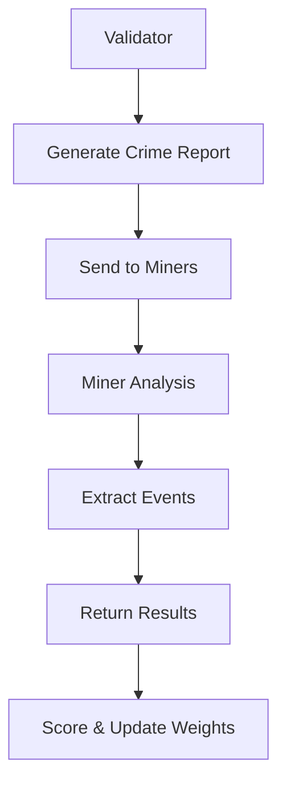

# Luminar Subnet

[](https://discord.gg/bittensor)
[](https://opensource.org/licenses/MIT)

> A Bittensor subnet for decentralized crime intelligence analysis using AI


## Overview

[Luminar](https://luminar.network/) is a Bittensor subnet that focuses on crime report analysis. Validators generate realistic crime reports, and miners analyze them to extract structured intelligence using AI models.

### Key Features

- **AI-Powered Analysis**: Uses OpenAI GPT models for text processing with rule-based fallbacks
- **Structured Output**: Extracts crime type, location, entities, and confidence scores
- **Flexible Processing**: Supports both OpenAI integration and CPU-only operation

## Quick Start

### Prerequisites

- Python 3.9+
- OpenAI API key
- 8GB+ RAM, 50GB+ storage

### Installation

```bash
# Clone repository
git clone https://github.com/Luminar-Network/Luminar-subnet.git
cd Luminar-subnet

uv sync && source .venv/bin/activate
```

### Running on Testnet

```bash
# Register on subnet 414
btcli subnet register --netuid 414 --subtensor.network test --wallet.name miner

# Start miner
python neurons/miner.py --netuid 414 --subtensor.network test --wallet.name miner --wallet.hotkey hotkey --axon.port port --axon.host host_ip --logging.debug

# Start validator (separate terminal)
python neurons/validator.py --netuid 414 --subtensor.network test --wallet.name validator --wallet.hotkey hotkey --axon.port port --axon.host host_ip --logging.debug
```

## Architecture



### Network Participants

**Validators**
- Generate crime reports using OpenAI or templates
- Evaluate miner responses for accuracy
- Update network weights based on performance

**Miners**
- Analyze crime reports to extract structured events
- Return confidence scores and entity information
- Process using OpenAI or rule-based fallbacks

## How It Works

1. **Report Generation**: Validator creates realistic crime report
2. **Analysis Request**: Report sent to miners via `CrimeReportAnalysisRequest`
3. **Event Extraction**: Miners analyze text and extract structured data
4. **Scoring**: Validator evaluates accuracy and updates weights

### Scoring System

| Component | Weight | Description |
|-----------|--------|-------------|
| Crime Type | 20% | Correct identification of crime category |
| Location | 20% | Accurate location extraction |
| Time Info | 20% | Proper time/date identification |
| Entities | 15% | Quality of extracted entities |
| Crime Report | 25% | Informative event report |

## Luminar Developer Roadmap

We're building the future of decentralized forensic intelligence. Here's what's coming:

### 🔍 Chat-Driven Investigation Interface
- Natural language querying of video content
- Highlight key frames and insights dynamically
- Conversational interface for investigative workflows

### 🎯 Enhanced Automated Detection
- Attribute detection: clothing, objects, and vehicles
- Real-time recognition of key features for rapid analysis
- Scalable detection pipelines for large video datasets

### 📊 Event Clustering & Timelines
- Aggregate raw detections into structured incident events
- Automatic timeline generation for chronological context
- Exportable reports suitable for integration into case management systems

### 🛠️ SDKs & APIs for Developers
- Programmatic access to detection and event data
- Build custom forensic or analytics applications on Luminar
- Extensible endpoints for integration with existing workflows and platforms

*Join us in revolutionizing crime intelligence through decentralized AI.*

## Installation & Setup

### Using UV (Recommended)

```bash
# Install UV package manager
curl -LsSf https://astral.sh/uv/install.sh | sh

# Setup project
git clone https://github.com/Luminar-Network/Luminar-subnet.git
cd Luminar-subnet
uv sync
source .venv/bin/activate
```

### Using pip

```bash
git clone https://github.com/Luminar-Network/Luminar-subnet.git
cd Luminar-subnet
python -m venv venv
source venv/bin/activate
pip install -r requirements.txt
pip install -e .
```

### Configuration

Create `.env` file:

```env
OPENAI_API_KEY=your_api_key_here
OPENAI_MODEL=gpt-4o-mini
```

## Deployment

### Testnet Deployment

1. **Create Wallets**
   ```bash
   btcli wallet new_coldkey --wallet.name miner
   btcli wallet new_hotkey --wallet.name miner --wallet.hotkey default
   ```

2. **Get Testnet TAO**
   ```bash
   btcli wallet faucet --subtensor.network test --wallet.name miner
   ```

3. **Register on Subnet 414**
   ```bash
   btcli subnet register --netuid 414 --subtensor.network test --wallet.name miner
   ```

4. **Start Nodes**
   ```bash
   # Terminal 1: Miner
   python neurons/miner.py --netuid 414 --subtensor.network test --wallet.name miner --wallet.hotkey hotkey --axon.port port --axon.host host_ip --logging.debug

   # Terminal 2: Validator
   python neurons/validator.py --netuid 414 --subtensor.network test --wallet.name validator --wallet.hotkey hotkey --axon.port port --axon.host host_ip --logging.debug
   ```

## File Structure

```
luminar-subnet/
├── neurons/
│   ├── miner.py           # Crime report analysis miner
│   └── validator.py       # Report generation and scoring validator
├── template/
│   ├── protocol.py        # Communication protocol
│   ├── base/              # Base classes
│   └── utils/             # Utility functions
├── scripts/
│   ├── setup_database.py  # Database management
│   └── deploy_testnet.sh  # Deployment automation
├── pyproject.toml        # Modern Python configuration
└── requirements.txt      # Legacy dependencies
```

## Configuration Options

### Environment Variables

| Variable | Description | Default |
|----------|-------------|---------|
| `OPENAI_API_KEY` | OpenAI API key for enhanced processing | None |
| `OPENAI_MODEL` | GPT model to use | gpt-4o-mini |
| `LOG_LEVEL` | Logging verbosity | INFO |

### Validator Settings

```bash
python neurons/validator.py \
    --netuid 414 \
    --subtensor.network test \
    --neuron.sample_size 20 \
    --neuron.timeout 300 \
    --logging.debug
```

### Miner Settings

```bash
python neurons/miner.py \
    --netuid 414 \
    --subtensor.network test \
    --blacklist.min_stake_threshold 1000 \
    --neuron.name luminar_miner \
    --logging.debug
```

## Troubleshooting

### Common Issues

**Registration Failed**
```bash
# Check wallet balance
btcli wallet balance --subtensor.network test --wallet.name miner

# Verify subnet info
btcli subnet metagraph --subtensor.network test --netuid 414
```

**Dependencies Issues**
```bash
# Reinstall dependencies
uv sync --reinstall

# Or with pip
pip install -r requirements.txt --force-reinstall
```

## Contributing

1. Fork the repository
2. Create feature branch: `git checkout -b feature/amazing-feature`
3. Commit changes: `git commit -m 'Add amazing feature'`
4. Push to branch: `git push origin feature/amazing-feature`
5. Open a Pull Request

## Resources

- **Website**: [https://luminar.network/](https://luminar.network/)
- **Documentation**: [docs/](docs/)
- **Bittensor Docs**: [https://bittensor.com/documentation/](https://bittensor.com/documentation/)

## License

This project is licensed under the MIT License - see the [LICENSE](LICENSE) file for details.

---

*Built with ❤️ for a safer world through decentralized intelligence*
